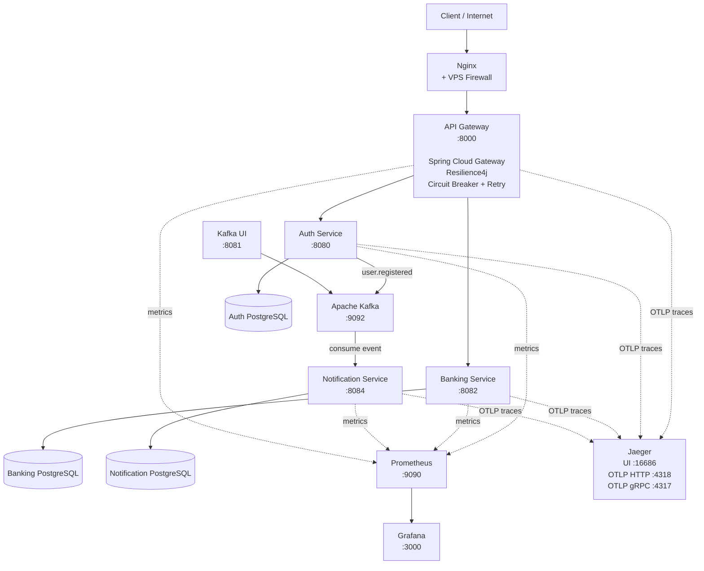

# Distributed Banking Microservices Platform


A production-oriented banking microservices platform demonstrating distributed systems, event-driven communication, observability, infrastructure automation, and cloud-native deployment practices.
## Architecture



| Service | Port | Purpose |
|---|---:|---|
| API Gateway | 8000 | API entry point |
| Auth Service | 8080 | Authentication |
| Banking Service | 8082 | Banking operations |
| Notification Service | 8084 | Notifications |
| PostgreSQL | 5432 | Databases |
| Kafka | 9092 | Event streaming |
| Kafka UI | 8081 | Kafka management |
| Prometheus | 9090 | Metrics |
| Grafana | 3000 | Dashboards |
| Jaeger UI | 16686 | Trace visualization |
| Jaeger OTLP HTTP | 4318 | Trace ingestion |
| Jaeger OTLP gRPC | 4317 | Trace ingestion |

 Auth (`8080`), banking (`8082`), and notification (`8084`) are internal to the Docker network and are not published to the host.
  
## What it does

- Provides a distributed banking platform built around independent Spring Boot microservices for authentication, banking operations, and notifications
- Exposes a single entry point through an API Gateway with request routing, Circuit Breaker, Retry, timeout handling, and failure fallbacks
- Implements JWT-based authentication with refresh tokens and role-based access control (`USER` / `ADMIN`)
- Supports bank account management and per-account transaction history
- Uses Apache Kafka for asynchronous, event-driven communication between services (`user.registered` → notification-service)
- Maintains database isolation with a separate PostgreSQL database for each service and independent Flyway migrations
- Provides observability with Micrometer metrics (Prometheus/Grafana), distributed tracing (OpenTelemetry OTLP → Jaeger), and JDBC tracing on auth and banking
- Propagates distributed trace context across service boundaries using W3C Trace Context
- Runs the complete application stack in Docker Compose (`--profile full` for application services)
- Automates CI with GitHub Actions: pull requests run Checkstyle, build, and tests; production deploy is a manual workflow that SSHs to a VPS

## Local run

**Prerequisites:** Java 21, Maven 3.9+, Docker with Compose plugin.

```bash
# 1. Clone and build JARs
git clone <repo-url>
mvn clean package -DskipTests

# 2. Copy the env file and adjust if needed
cp .env.example .env   # or use the existing .env as-is for local dev

# 3. Start the full stack (all services + Postgres + Kafka + monitoring)
docker compose --profile full up --build
```

### Health checks

From the host in Compose, only the gateway is reachable:

```bash
curl http://localhost:8000/actuator/health
```

Auth, banking, and notification expose `/actuator/health` on their internal ports; Compose uses these for container health checks. They are reachable from the host only when services are run outside Docker (e.g. via Maven).

### Observability

| Layer | Implementation                                                                                                                                           |
|-------|----------------------------------------------------------------------------------------------------------------------------------------------------------|
| Metrics | Micrometer + Prometheus registry on auth, banking, and notification; scraped via `monitoring/prometheus.yml`                                             |
| Tracing | Micrometer Tracing with OpenTelemetry OTLP HTTP exporter on api-gateway, auth-service, and banking-service → Jaeger (`MANAGEMENT_OTLP_TRACING_ENDPOINT`) |
| JDBC tracing | `datasource-micrometer-spring-boot` + `datasource-micrometer-opentelemetry` on auth-service and banking-service                                          |
| Propagation | W3C Trace Context across gateway and downstream HTTP calls                                                                                               |
| Dashboards | Grafana (`:3000`) - add Prometheus (`http://prometheus:9090`) as a data source inside the Grafana UI                                                     |


---

## API Documentation

All REST traffic goes through the API Gateway at `http://localhost:8000`. Auth-service exposes Swagger UI at `/swagger-ui.html` when run locally on port `8080` (not routed through the gateway).

Protected endpoints require a `Bearer` JWT access token from `POST /auth/login`.

Example flow:

```bash
# 1. Register
POST http://localhost:8000/auth/register
{"email": "user@bank.com", "password": "secret123", "name": "Jane Doe"}

# 2. Login → copy accessToken from the response
POST http://localhost:8000/auth/login
{"email": "user@bank.com", "password": "secret123"}

# 3. Create account
POST http://localhost:8000/accounts
Authorization: Bearer <token>
{"currency": "USD"}

# 4. Deposit funds (use the account id from step 3)
POST http://localhost:8000/transactions
Authorization: Bearer <token>
{"accountId": "<account-uuid>", "transactionType": "DEPOSIT", "currency": "USD", "amount": 100.00}

# 5. List your transactions
GET http://localhost:8000/transactions/my
Authorization: Bearer <token>
```

`transactionType` accepts `DEPOSIT` or `WITHDRAW`. `currency` accepts `USD`, `EUR`, `GBP`, or `UAH`.

---

## CI/CD

| Workflow | Trigger | Actions |
|----------|---------|---------|
| **PR Checks** (`.github/workflows/github-pipeline.yml`) | Pull requests to `main` or `develop` | Checkstyle, compile, test; uploads Surefire reports |
| **Deploy** (`.github/workflows/deploy.yml`) | Manual `workflow_dispatch` | `mvn clean verify`, then SSH deploy with `docker compose --profile full up --build --remove-orphans --wait -d` |

Repository variables: `VPS_HOST`, `VPS_USER`. Secret: `SSH_PRIVATE_KEY`.

## Notes

This repository focuses on microservice architecture and infrastructure rather than banking domain complexity.
